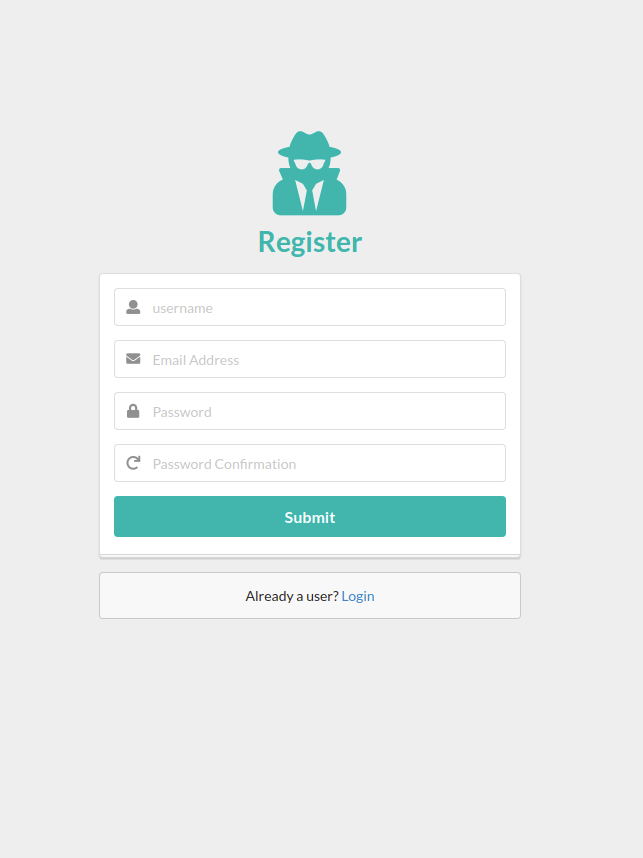
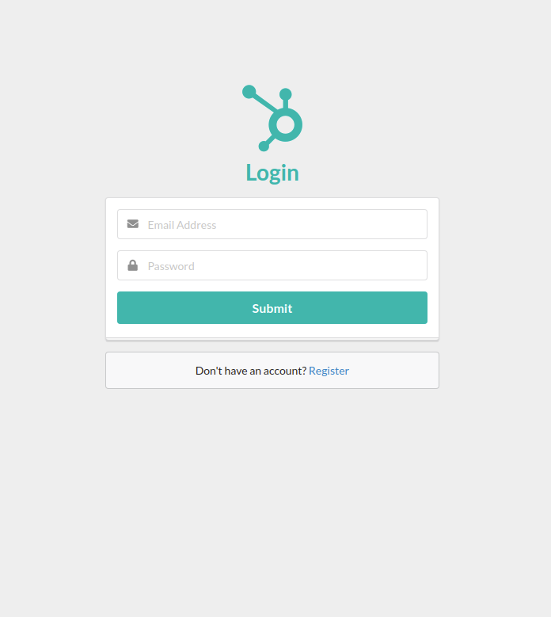
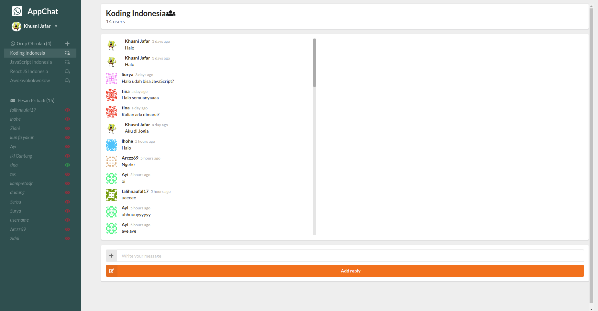

<div align=center>
    <h1>ChatApp</h1>
</div>


## Table of Contents

- [Table of Contents](#table-of-contents)
- [Introduction](#introduction)
- [Features](#features)
- [Installation](#Installation)
- [Screenshoot](#screenshoot)
- [Contributors](#contributors)

## Introduction

ChatApp is realtime chatting that you can chat in group and personal

## Features

- Login & Register
- Group Chat
- Private Chat
- Current Location

## Installation

### Clone
```
$ git clonehttps://github.com/Khusnijafar/Chat-App-Firebase.git
$ cd Chat-App-Firebase
$ npm install
```

### Create Environment Variable
```
Make sure you have login on https://console.firebase.google.com, and create a project, then you setup your address project on firebase.js

```
### Start Development Server
```
$ npm start
```

## Screenshoot

### Register Page


### Login Page


### Home Page



### License
----

<center>
  <table>
    <tr>
      <td align="center">
        <a href="https://github.com/mhdrare">
          <br/>
          <sub><b>Khusni Jafar</b></sub>
        </a>
      </td>
    </tr>
  </table>
</center>
